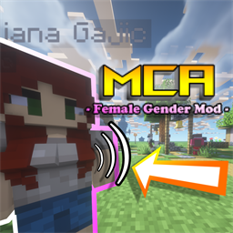

<p align="center"></p>

# MCA Female Gender Mod

把 Female Gender Mod 的胸部外观与物理模拟，移植到凡家物语（MCA）的女性 NPC 上。

Ports the breast appearance and physics simulation from Female Gender Mod to the female NPCs of Minecraft Comes Alive (MCA).

---

## English

### About

An addon that brings **Female Gender Mod**'s breast rendering and spring-damper physics to the female NPCs of **Minecraft Comes Alive (MCA)**.

Size and shape are driven by MCA's genetics system, so they are inherited, randomized per villager, and editable in MCA's villager editor.

### Features

- Renders breasts on female villagers (regular and zombie); textures are generated at runtime from each villager's own MCA skin
- Spring-damper physics: sways while walking, and reacts to impacts and jumps
- Adds 5 genes to MCA's gene pool: separation, height, depth, rotation and growth
- Adds a **"More Breast Settings"** page to MCA's villager editor (4 sliders + 5 toggles + 2 physics sliders)
- Development starts at the **teen** stage — babies, toddlers and children do not render breasts
- **Pregnancy growth**: each pregnancy multiplies the size by a random factor, capped at 1.25× the natural value, and it is not inherited by children
- Villagers that already exist in older saves are given randomized appearance values once

### Requirements

| Component | Version |
|---|---|
| Minecraft | 1.21.1 |
| NeoForge | 21.1.0 or newer |
| MCA (Minecraft Comes Alive) | 7.7.x |

### Installation

> **Both the client and the server must install this mod.**

This is not a suggestion. The mod appends synced fields to MCA's gene pool, and the network protocol identifies those fields by index. Installing it on one side only will **silently** corrupt villager data (gender, name, genes) instead of crashing, which makes it far harder to diagnose.

1. Install Minecraft 1.21.1 with NeoForge 21.1.0+
2. Put MCA into the `mods` folder
3. Put this mod's jar into the `mods` folder **on both the client and the server**
4. Launch the game

Female Gender Mod itself is **not** required. Both mods can coexist — FGM handles players, this mod handles MCA villagers.

### Usage

Use MCA's needle or comb on a female villager to open the editor, then switch to the **"More Breast Settings"** page.

Sliders — these are per-villager genes and are synced to the server:

| Slider | Effect |
|---|---|
| Separation | horizontal distance between the two sides |
| Height | vertical position |
| Depth | how far they protrude |
| Rotation | outward tilt angle |

Toggles and physics sliders — these are your own client settings, stored in `mcabp-client.toml`:

| Option | Effect |
|---|---|
| Enable Rendering | master switch for the whole mod |
| Enable Physics | turns sway off while keeping rendering |
| Split Sway | each side wobbles independently (off = both move in perfect sync) |
| Show In Armor | breasts stay visible under chest armor |
| Sway In Armor | chest armor no longer dampens the wobble |
| Wobble Amount | how violent the sway from impacts and jumps is |
| Wobble Duration | how long the wobble takes to settle |

### Building

```
./gradlew build
```

The jar is written to `build/libs/`.

### License and Credits

Released under **LGPL-3.0**, matching the upstream mod it derives from.

- **Female Gender Mod** by WildfireRomeo — LGPL-3.0 — the rendering and physics code is ported and modified from it
- **Minecraft Comes Alive (MCA)** — the host mod — GPL-3.0

---

## 中文

### 简介

把 **Female Gender Mod** 的胸部渲染与弹簧-阻尼物理模拟，移植到 **凡家物语（MCA）** 的女性 NPC 上。

胸部的大小与形态由 MCA 的基因系统驱动，因此会遗传、每个村民随机生成，并可在 MCA 的村民编辑器中调整。

### 功能

- 为女性村民（普通与僵尸）渲染胸部，贴图在运行时依据该村民自己的 MCA 皮肤动态生成
- 弹簧-阻尼物理：行走时会晃动，也会对受击和跳跃做出反应
- 向 MCA 的基因池追加 5 个基因：分离、高度、深度、旋转、发育度
- 村民编辑器新增「**更多胸部设定**」页（4 个滑块 + 5 个开关 + 2 个物理滑块）
- 发育从**青春期**开始 —— 婴儿、幼儿、儿童不渲染胸部
- **怀孕二次发育**：每次怀孕会按随机倍率增大，上限为自然值的 1.25 倍，且不遗传给子代
- 老存档中已有的村民会自动补一次随机外观

### 依赖

| 组件 | 版本 |
|---|---|
| Minecraft | 1.21.1 |
| NeoForge | 21.1.0 或更新 |
| MCA（凡家物语） | 7.7.x |

### 安装

> **客户端与服务端都必须安装本模组。**

这不是建议。本模组向 MCA 的基因池追加了同步字段，而网络协议是按序号识别这些字段的。只装一端会**静默地**弄乱村民数据（性别、名字、基因），而不是直接崩溃，所以排查起来更麻烦。

1. 安装 Minecraft 1.21.1 与 NeoForge 21.1.0+
2. 把 MCA 放进 `mods` 文件夹
3. **在客户端与服务端的 `mods` 文件夹里都放入本模组的 jar**
4. 启动游戏

**不需要**安装 Female Gender Mod 本体。两者可以共存 —— FGM 管玩家，本模组管 MCA 村民。

### 使用

用 MCA 的针线或梳子对准女性村民打开编辑器，然后切到「**更多胸部设定**」页。

滑块 —— 这些是村民的基因，会同步到服务端：

| 滑块 | 作用 |
|---|---|
| 分离 | 左右两侧之间的水平距离 |
| 高度 | 垂直位置 |
| 深度 | 向前突出的程度 |
| 旋转 | 向外张开的角度 |

开关与物理滑块 —— 这些是你自己的客户端设置，保存在 `mcabp-client.toml`：

| 选项 | 作用 |
|---|---|
| 开启渲染 | 本模组总开关 |
| 启用物理 | 关闭后不再晃动，但仍会正常渲染 |
| 左右独立晃动 | 两侧各自独立晃动；关闭则两侧完全同步 |
| 穿甲时胸不隐藏 | 穿着盖住胸部的胸甲时依然显示 |
| 穿甲时可以晃动 | 忽略胸甲的束缚，穿甲也照常晃动 |
| 晃动幅度 | 受击、跳跃等外力造成的晃动有多剧烈 |
| 晃动时长 | 受击后晃动持续多久才停下 |

### 构建

从源码构建需要 MCA 的 jar，它**不包含**在本仓库中 —— 那是第三方二进制，放进来会让仓库变臃肿。

1. 下载适用于 NeoForge 1.21.1 的 **MCA** 7.7.x
2. 把 jar 放到 `libs/mca.jar`
3. 执行：

```
./gradlew build
```

产物在 `build/libs/` 下。

### 许可与致谢

以 **LGPL-3.0** 许可发布，与所衍生的上游模组保持一致。

- **Female Gender Mod**（作者 WildfireRomeo）—— LGPL-3.0 —— 渲染与物理代码移植并修改自该项目
- **凡家物语 MCA** —— 本模组依附的宿主模组 —— GPL-3.0
